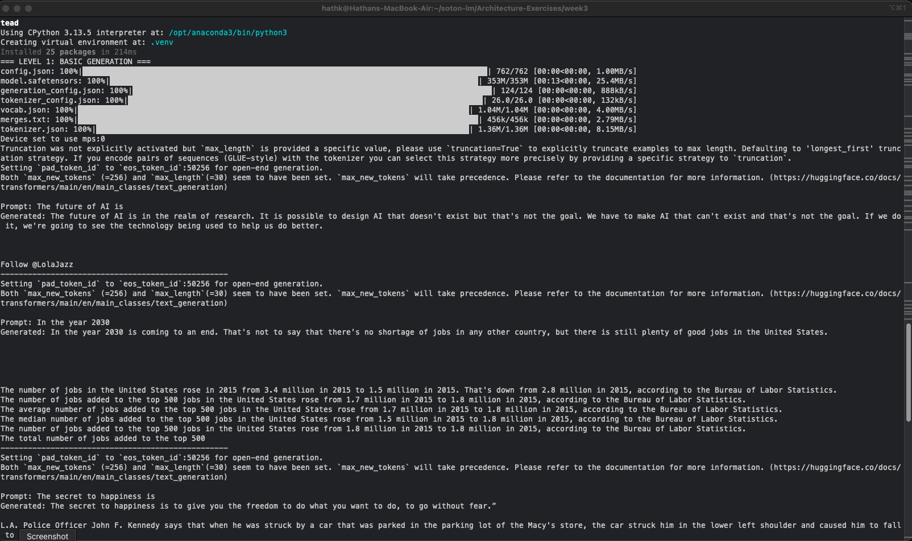

# Hathan Khatkar - Diagnostic Task Submission

**LEVEL REACHED:** 4/4

---

## LEVEL 1: ✅

---

## LEVEL 2: ✅

- [Code link](submissions/week3/hathan-khatkar/diagnostic_task.py)
- [Results link](submissions/week3/hathan-khatkar/result.txt)

### Brief Summary of Findings

**What did changing parameters do?**

- **max_length** - The model overrode this parameter, so I switched to use `max_new_tokens` which limits the number of tokens in the generated output.
- **temperature** - Increasing temperature increased the scope of generated text, making text less specific and more explorative.
- **top_k** - Decreasing top_k increased the likelihood of the generated output being similar to previous outputs, controlling variation of responses.

**Which settings produced best results?**

Depends on the prompt and expected response. If you're expecting more deterministic responses, then having a lower top_k will be beneficial. If you value more creative responses, higher temperature will complement this.

However, there are more logical ways to determine this, e.g., measuring semantic similarity score with embedding models. For my example prompt 'to make a sandwich you need to', the most relevant results were from `(max_length=50, temperature=1.0, top_k=50)`.

**How long did generation take?**

Around 0.3 - 0.8s depending on max tokens.

---

## LEVEL 3: ✅ (Option C)

- [Code Link](submissions/week3/hathan-khatkar/diagnostic_task.py)

**Chose option C - Compare models:**

**Conclusions:**
- **distilgpt2**: Fastest, smallest, good for quick tests
- **gpt2**: Balanced size/quality, good default choice
- **gpt2-medium**: Best quality, slower, needs more memory

---

## LEVEL 4: ✅

**Project name:** Hybrid Property Advisor System

**What it does:**

The project purpose is to use data retrieval techniques to inform an answer based on a specific domain (as a Property Advisor in the Southampton area). It will use prompt engineering to classify the initial input and from there choose an appropriate data retrieval technique (SQL generation / embedding search) to retrieve the relevant data. It will then use the retrieved data to answer the user's question.

- [Code Link](submissions/week3/hathan-khatkar/level4_hybrid_qa.py)

**Example Output:**

**To run:**
- **Note:** Includes sentence-transformers library, install using: `uv pip install sentence-transformers`
- **Note:** Run the script with: `uv run python level4_hybrid_qa.py`

---

## TIME SPENT

Approx 6 hours (mainly on level 3 + 4)

---

## WHAT I FOUND EASY

Level 1 + 2

## WHAT I FOUND HARD

In level 4, generating accurate/coherent answers with smaller LMs (for SQL generation + answer synthesis) - had to switch to better performing models.
